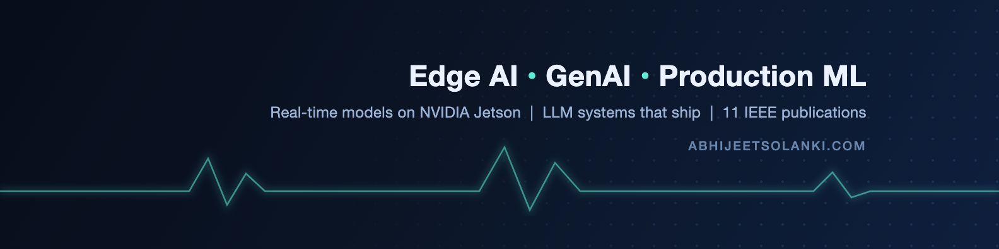
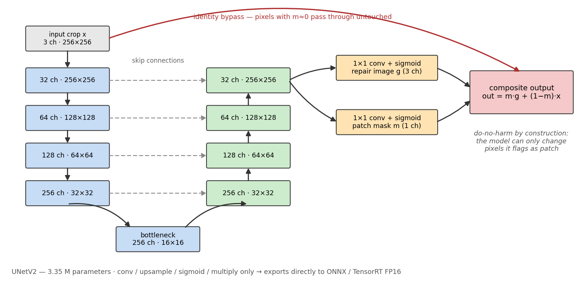

  
  
  
  

I make AI work where it is hardest: on edge devices with tight latency, memory, and power
budgets, and in production where demos do not count.

Currently a Software Engineer at **Arctera**, shipping GenAI incident tooling on Azure and
AKS. Based in Nashville, TN, open to relocation.

<table>
<tr>
<td width="33%" valign="top">

**⚡ Edge AI**

Real-time perception on NVIDIA Jetson — TensorRT, ONNX Runtime, quantization, pruning.
Took a deployed detector from **72% → 93%** inside the same compute budget.

</td>
<td width="33%" valign="top">

**🤖 GenAI in production**

LLM agents, RAG, function calling, evals and guardrails on Azure OpenAI, LangChain and
vLLM. Systems that survive contact with real users.

</td>
<td width="33%" valign="top">

**🚗 Autonomous systems**

Camera and LiDAR perception that stays accurate when the physical world misbehaves —
adversarial patches, laser attacks, sensor spoofing.

</td>
</tr>
</table>

**11 peer-reviewed IEEE publications**, 5 first-author, including two IEEE Access journal
articles. Four more under review.

---

## Selected work

### 🛑 [Adversarial Patch Removal for Stop Signs](https://github.com/ChiefAj23/qcar-patch-removal)

A printed sticker on a stop sign makes a detector miss it in over half of approach frames.
This 3.35M-parameter dual-head U-Net erases the sticker before detection on our QCar2
physical testbed, taking detection from **48% → 76%** with no regression on clean signs.
The mask head means the model can only alter pixels it flags as patch — do-no-harm by
construction. Exports directly to ONNX and TensorRT FP16.

### 🔊 [AI Voice Compliance Auditor](https://github.com/ChiefAj23/AI-Voice-Compliance-Auditor)

Full-stack GenAI app that turns raw call recordings into compliance and coaching insights:
Whisper transcription, 0–100 scoring, toxicity and missing-disclosure detection, alert
workflows, and SHAP explainability so a reviewer can see *why* a call was flagged.
FastAPI + React/TypeScript.

### 📍 [Nashville Crime Hotspot Analysis](https://github.com/ChiefAj23/Nashville-Crime-Hotspot-Analysis-App)

DBSCAN clustering over Metro 911 call data, surfacing hotspots and proximity safety alerts
through a FastAPI + React map dashboard.

### 🖥 [gem5 Benchmark Suite](https://github.com/ChiefAj23/Gem5BenchSuite)

Workload benchmarking on the gem5 microarchitecture simulator.

### 🛰 Published research code

[**ReAL**](https://github.com/ChiefAj23/ReAL-ReflectiveAttack-Detection-Lidar) — machine
learning detection of reflective attacks against LiDAR odometry ·
[**GNAP**](https://github.com/ChiefAj23/GNAPing-On-the-Job) — attacking and defending
facial detection on edge devices. Both IEEE SoutheastCon 2025.

> *VLM perception for autonomous driving is in progress — benchmarking vision-language
> models as open-vocabulary detectors on real driving data, with safety-weighted metrics.
> Held back pending publication.*

---

## Research

Robustness of edge-deployed perception under physical-world attack.

| Venue | Paper |
|---|---|
| **IEEE Access 2026** | Blinded by the Beam: A Unified Real-Time Defense Against Laser-Based Attacks on Navigational Perception of Autonomous Vehicles |
| **IEEE Access 2025** | Survey of Navigational Perception Sensors' Security in Autonomous Vehicles |
| **ISVLSI 2024** | Investigate the Effects of Laser Attack on the Intelligence of the AV Perception |

Full list on [Google Scholar](https://scholar.google.com/citations?view_op=search_authors&mauthors=Abhijeet+Solanki).
Some submitted papers are not listed due to double-blind review and will appear after
acceptance.

🥇 Two 1st Place research awards — ACM Mid-Southeast (#1 of 38), TTU Research and Inquiry
Day (#1 of 220) · IEEE-HKN and Tau Beta Pi · Reviewer, IEEE DCAS 2026

---

## Tools

**Machine learning**

Quantization (PTQ/QAT) · pruning · edge inference · RAG · agents · XAI (Grad-CAM, SHAP)

**Languages and backend**

**Cloud and infrastructure**

---

## Elsewhere

[abhijeetsolanki.com](https://www.abhijeetsolanki.com/) ·
[LinkedIn](https://www.linkedin.com/in/abhijeet-solanki) ·
[Medium](https://abhijeet-solanki.medium.com) ·
[abhijeet.solanki@outlook.com](mailto:abhijeet.solanki@outlook.com)

I am looking for roles putting models on edge hardware and making them fast, or building
GenAI systems that hold up in production. Happy to compare notes either way.
